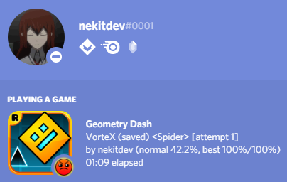

gd.rpc
======

.. image:: https://img.shields.io/pypi/l/gd.rpc.svg
    :target: https://opensource.org/licenses/MIT
    :alt: Project License

.. image:: https://img.shields.io/pypi/v/gd.rpc.svg
    :target: https://pypi.python.org/pypi/gd.rpc
    :alt: PyPI Library Version

.. image:: https://img.shields.io/pypi/pyversions/gd.rpc.svg
    :target: https://pypi.python.org/pypi/gd.rpc
    :alt: Required Python Versions

.. image:: https://img.shields.io/pypi/status/gd.rpc.svg
    :target: https://github.com/nekitdev/gd.rpc
    :alt: Project Development Status

.. image:: https://img.shields.io/pypi/dm/gd.rpc.svg
    :target: https://pypi.python.org/pypi/gd.rpc
    :alt: Library Downloads/Month

.. image:: https://img.shields.io/endpoint.svg?url=https%3A%2F%2Fshieldsio-patreon.herokuapp.com%2Fnekit%2Fpledges
    :target: https://patreon.com/nekit
    :alt: Patreon Page [Support]

gd.rpc is a library that implements GD Discord RPC in Python.

Config
------

The config file, ``rpc_config.toml`` is located in the same directory as ``gd/rpc.py`` or ``rpc.exe`` file.
It is created automatically on first run. For more details on how to configurate, there is a ``rpc_config.toml`` file located in the root of this repository that gives more information on arguments.

Installing
----------

**Python 3.6 or higher is required**

To install the library, you can just run the following command:

.. code:: sh

    # Windows
    py -3 -m pip install -U gd.rpc

In order to install the library from source, you can do the following:

.. code:: sh

    $ git clone https://github.com/nekitdev/gd.rpc
    $ cd gd.rpc
    $ python -m pip install -U .

Running
-------

Running the app is quite simple.

You can either invoke it from python:

.. code:: python3

    import gd.rpc

    gd.rpc.run()

Or run a console command:

.. code:: sh

    $ python -m gd.rpc

    # OR

    $ gd.rpc

Building
--------

You can build an executable file from the ``gd/rpc.py`` file using *PyInstaller*:

.. code:: sh

    $ pyinstaller --onefile --exclude-module PIL --exclude-module numpy --exclude-module IPython --exclude-module Crypto --exclude-module lxml --icon=icon.ico gd/rpc.py

Generated executable will be in ``./dist`` folder.

Authors
-------

This project is mainly developed by `nekitdev <https://github.com/nekitdev>`_.
